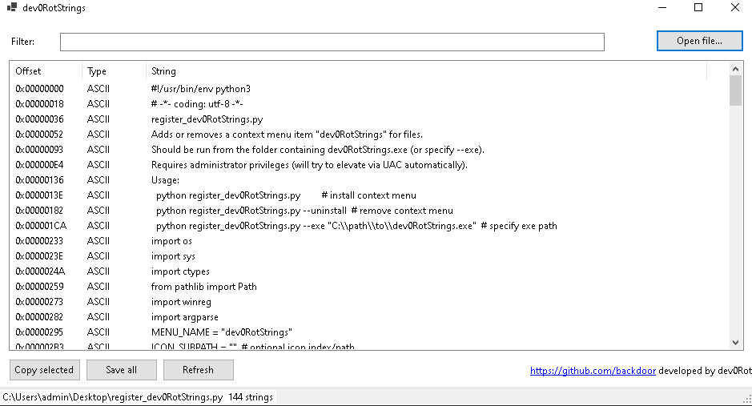

# dev0RotStrings

**dev0RotStrings** is a Windows application that extracts strings from any binary file (.exe, .dll, etc.) and displays them in a modern, user-friendly interface.

---

## Features

- Extract **ASCII** and **UTF-16LE** strings from any binary file.
- Right-click context menu integration (optional, via installer script) to open files directly.
- Filter strings by text.
- Copy selected strings or save all strings to a `.txt` file.
- Double-click a string to view it in a popup window.
- Modern, clean **GUI** built with **C# Windows Forms**.
- Footer displays:
  - [GitHub](https://github.com/backdoor831246)
  - `developed by dev0Rot`
- Window title: **dev0RotStrings**

---

## Screenshots

---

## Installation

1. Download the latest release from this repository.
2. Place `dev0RotStrings.exe` in your desired folder.
3. (Optional) Use `register_dev0RotStrings.py` to add a context menu entry in Windows Explorer.

---

## Usage

- Open the application and click **Open File** to load a binary.
- Strings will be displayed in the main table.
- Use the **Filter** textbox to search for specific strings.
- **Copy Selected** copies highlighted strings to the clipboard.
- **Save All** exports all strings to a `.txt` file.
- **Refresh** reloads the currently opened file.
- Double-click a string to view it in a separate dialog.

---

## Context Menu Integration (Optional)

- Right-click any file (.exe, .dll, etc.) and select **dev0RotStrings** to open it directly in the app.
- For installation, see [`register_dev0RotStrings.py`](register_dev0RotStrings.py).

---

## License

MIT License – free to use and modify.

---

## Author

**dev0Rot**  
GitHub: [https://github.com/backdoor831246](https://github.com/backdoor831246)
